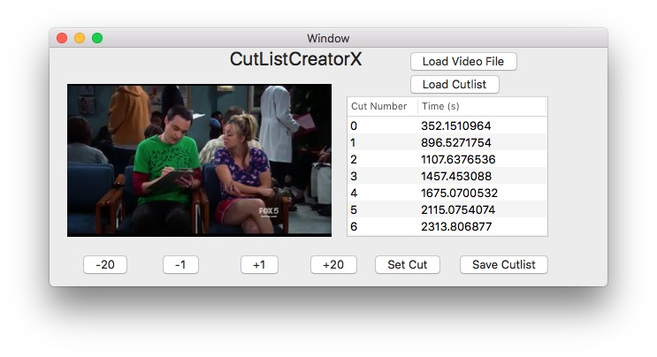

# CutListCreatorX

A macOS application to generate cutlists for video files from OnlineTvRecorder.com (OTR).
Currently, the app is basically a playground to get to know SWIFT programming and not really a production ready app :)
Even though most parts are already working, the code needs a lot of improvement: there are nearly no error checks and some parts are not very nicely written.
The app was developed with Xcode 8/Swift 3 (on macOS El Capitan) and works only for mp4 files right now.

### Screenshot:

### TODO:
- Upgrade to Switft4
- Encapsulate cutlist specific code
- Implement error checks
- Code style improvements
- Implement Second View Controller to set an author and a cutlist rating
- Implement Export to cutlist.at function
- Run avcut program and cut video file directly
- Add avi support (e.g. by converting AVI files in the background to mp4 with ffmpeg)
