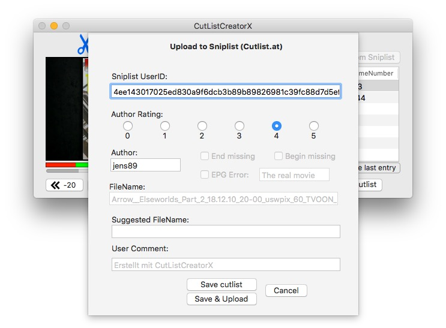

# CutListCreatorX
  
A macOS application to generate cutlists for video files from OnlineTvRecorder.com (OTR).  

Even though most parts are already working, the code needs a lot of improvement: there are nearly no error checks and some parts are not very nicely written.  

The app was developed with Xcode 8/Swift 3 (on macOS El Capitan) and works only for mp4 files right now.  

### Keyboard Control
Left Arrow: One Frame back  
Right Arrow: One Frame forward  
MouseWheel (in video frame): change by around 8 frames back or forward  

### Screenshot:

### TODO:
- Upgrade to Switft4
- Implement error checks
- Code style improvements
- ~~Implement Second View Controller to set an author and a cutlist rating~~
- ~~Implement Export to cutlist.at function~~
- Run avcut program and cut video file directly
- Add avi support (e.g. by converting AVI files in the background to mp4 with ffmpeg)
- Load list of cutlists from Sniplist and use one of them as a template
- Rate downloaded cutlists

### Credit
Icon made by Freepik (freepik.com) from www.flaticon.com.